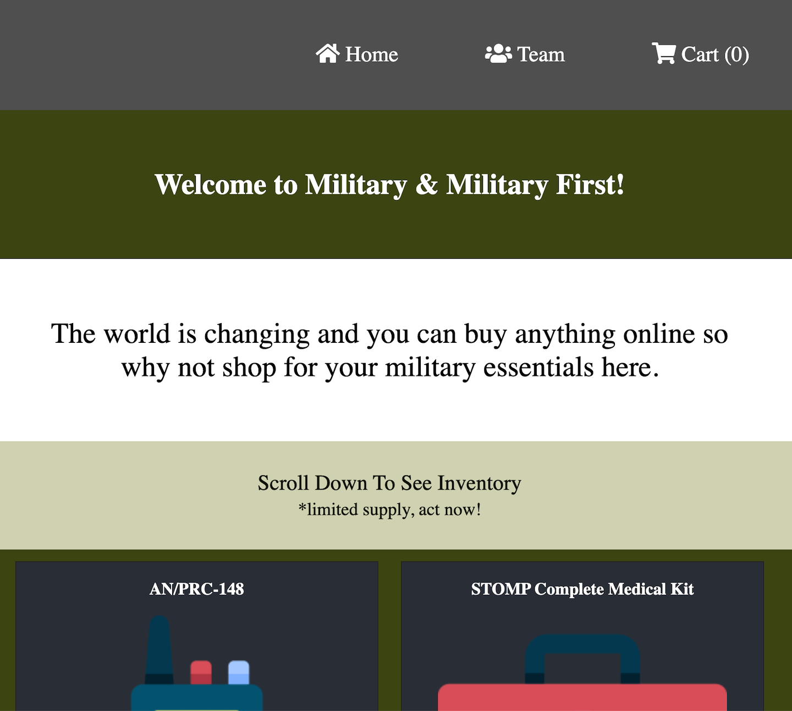

# theE-Commerce-101

A fun e-commerce app that I built just using react. The online store is a military store that sells things like guns, automobiles, and even tanks!

HTML, CSS, JS, REACT

Live Link = https://themilitarystore.herokuapp.com/

<h3>Summary</h3>
I built this app because I wanted to try my hands out and create the frontend of an e-commerce site. I enjoyed building this app because I've never built anything of the sort. I am looking forward to the challenge in building a full stack e-commerce store. For now, I am satisfied with this project because it helped me understand more about using React hooks and the context API.

<h3>Author</h3>

Roger Alexander - Full Stack Developer <a href="http://www.douschesois.com">Portfolio Website</a>

